<p align="center">
  
</p>

# SSHSpan

🔐 Cross-platform SSH key manager for the desktop.

SSHSpan is an Electron app that gives you a single, encrypted home for every SSH
key you own. Generate new keys, import existing ones, organize them, and deploy
them into `~/.ssh/config` — all from a keyboard-friendly GUI. Private keys are
encrypted at rest with AES-256-GCM behind a master password; the master password
itself lives only in memory and auto-locks after 15 minutes of inactivity.

Everything runs locally. No cloud, no telemetry, no network access — ever.

## Features

- **Generate keys** — RSA (3072–8192 bits), Ed25519, and ECDSA (nistp256/384/521), built on Node's native `crypto` module.
- **Import keys** — PEM private (PKCS#8 / PKCS#1 / SEC1), OpenSSH new-format private keys (including passphrase-protected), PuTTY `.ppk` (version 3, including passphrase-protected), PEM public keys, and `authorized_keys` public lines.
- **Export keys** — OpenSSH new-format private, PuTTY `.ppk` (version 3), PKCS#8 PEM (plain or AES-256-CBC encrypted), SPKI PEM public, and `authorized_keys` lines.
- **Encrypted vault** — every private key is encrypted with AES-256-GCM. The master password is never stored; only a scrypt verification hash is persisted.
- **Deploy to SSH config** — writes reversible `Host` blocks into `~/.ssh/config` between marker comments, so they can be removed cleanly.
- **Audit log** — append-only record of key create/update/delete, vault lock/unlock, and config writes.
- **Bitwarden / Vaultwarden sync (optional)** — mirror your keys to SSH key items in your own vault, two-way, manual or on an interval.
- **Offline by design** — zero telemetry; no network access unless you enable the Bitwarden sync, which talks only to the server you configure.

## Installation

### From a release (recommended)

Download the installer for your platform from the [releases page](https://github.com/AGSQ11/SSHSpan/releases):

- **Windows** — `SSHSpan-Setup.exe` (NSIS installer) or `SSHSpan-Portable.exe`.
- **Linux** — `SSHSpan.AppImage` or the `.deb` package.

### From source

SSHSpan requires **Node.js 18 or later**.

```bash
git clone https://github.com/AGSQ11/SSHSpan.git
cd sshspan
npm install
npm start
```

Build a distributable for your platform:

```bash
npm run dist:win     # Windows: NSIS + portable installers
npm run dist:linux   # Linux: AppImage + deb
```

The build produces artifacts under `release/` (configurable in `package.json`).

## Usage

### 1. Create a vault

The first time you open SSHSpan you are prompted to set a **master password**.
This password encrypts every private key from that point on. It is never
written to disk.

### 2. Generate or import keys

Open the **New Key** modal. On the **Generate** tab pick a key type and size;
on the **Import** tab paste a PEM, OpenSSH, or `authorized_keys` line. New keys
are encrypted immediately if the vault is unlocked.

### 3. Export keys

Select a key, choose an export format, and save it. Exported private keys can be
passphrase-protected (OpenSSH uses bcrypt KDF; PKCS#8 uses AES-256-CBC).

### 4. Deploy to `~/.ssh/config`

On the **SSH Config** view, select keys and click **Deploy to ~/.ssh/config**.
SSHSpan writes `Host` blocks between these markers so they can be removed
cleanly later:

```
# >>> SSHSpan managed >>>
Host myserver
    HostName myserver.example.com
    IdentityFile ~/.sshspan/keys/<key-id>
    IdentitiesOnly yes
# <<< SSHSpan managed <<<
```

### 5. Sync with Bitwarden or Vaultwarden (optional)

In **Settings → Bitwarden / Vaultwarden sync**, enter your vault server URL
(e.g. `https://vault.example.com` for a self-hosted Vaultwarden), the account
email, the vault master password, and a folder name (`SSHSpan` by default).
Then:

- **Test connection** verifies the server, credentials, and KDF settings.
- **Sync now** mirrors keys in both directions: local keys become SSH key
  items in your vault, and SSH key items from the vault are imported locally.
  Matching is done by fingerprint; the newest change wins per item;
  deletions are never propagated automatically.
- **Auto-sync** repeats the sync on a fixed interval (5–1440 minutes) while
  the vault is unlocked.

Keys are encrypted client-side with the Bitwarden protocol before anything is
sent — the server only ever receives ciphertext. Self-hosted vaults must be
reachable via a public hostname (LAN/localhost addresses are refused by
design). Two-factor accounts are not supported yet; use a dedicated account
without 2FA. See `docs/SECURITY.md` for the details.

### Data locations

| Artifact | Path |
|---|---|
| Vault database (private keys encrypted at rest) | `~/.sshspan/sshspan.db` |
| Key files (deployed) | `~/.sshspan/keys/<key-id>` |
| Managed SSH config block | `~/.ssh/config` (between markers) |

## Keyboard-free UI

SSHSpan is fully navigable with a mouse, but every major action is reachable
from the keyboard:

- **Ctrl/Cmd + 1–4** — switch between Keys, SSH Config, Settings, and Audit views.
- **Ctrl/Cmd + N** — open the New Key modal.
- **Ctrl/Cmd + L** — lock the vault.
- **Ctrl/Cmd + ,** — open Settings.
- **Escape** — close modals and dialogs.

## FAQ

**Why does SSHSpan use sql.js instead of better-sqlite3?**

sql.js is a pure WebAssembly SQLite engine — there is no native compilation, so
the same code runs on Windows, macOS, and Linux without platform-specific build
steps. better-sqlite3 requires native bindings, which complicates distribution
and cross-platform builds.

**Why is there no cloud sync?**

SSHSpan is intentionally local-first. Private keys never leave your machine
unless you explicitly enable the Bitwarden/Vaultwarden sync, which sends them
end-to-end encrypted to your own vault (the optional sync described above).
There is no built-in cloud of our own, no telemetry, and no account — the
app makes no network calls until you configure a sync destination yourself.

**How does SSHSpan interoperate with ssh-keygen?**

Fingerprints are computed identically to `ssh-keygen -lf`:
`SHA256:<base64(sha256(SSH public wire blob))>` with no padding, so fingerprints
match across tools. Public keys are written as standard `authorized_keys` lines,
and private keys can be exported in OpenSSH new format for direct compatibility.

**Why does the database file itself not appear encrypted?**

The SQLite file stores only the *encrypted* private-key blobs plus the master
password verification hash. The file is not wrapped in a separate encryption
layer — the sensitive data inside already is. See `docs/SECURITY.md` for the
full threat model and recommended mitigations (full-disk encryption, etc.).

## License

MIT — see [LICENSE](LICENSE).

## Documentation

- `docs/ARCHITECTURE.md` — process diagram, IPC contract, module walkthrough, schema, and reasoning log.
- `docs/SECURITY.md` — threat model, crypto primitives, key lifecycle, at-rest format, and limitations.
- `docs/PRIVACY.md` — zero-telemetry guarantee, on-disk artifacts, and full removal.
- `CONTRIBUTING.md` — how to contribute.
- `CODE_OF_CONDUCT.md` — Contributor Covenant v2.1.
