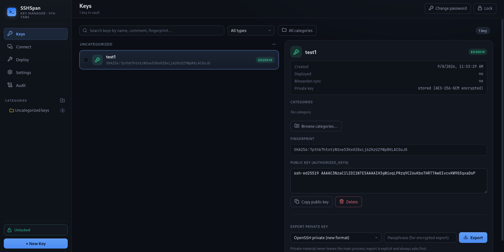
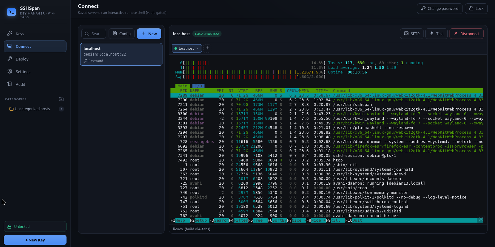
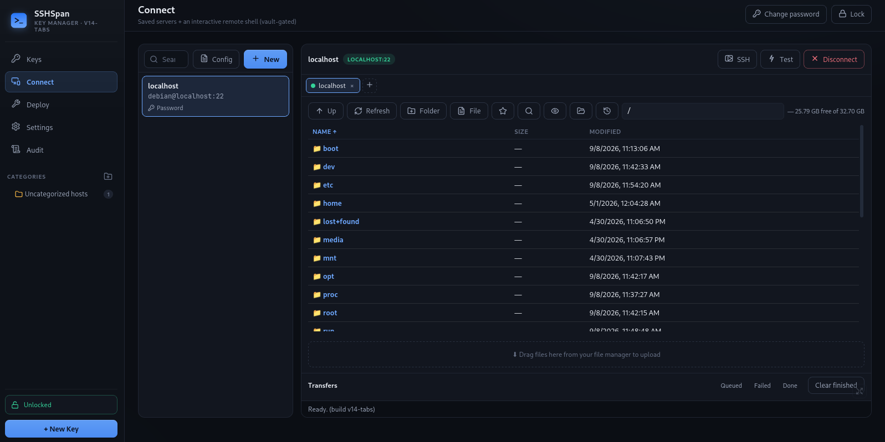
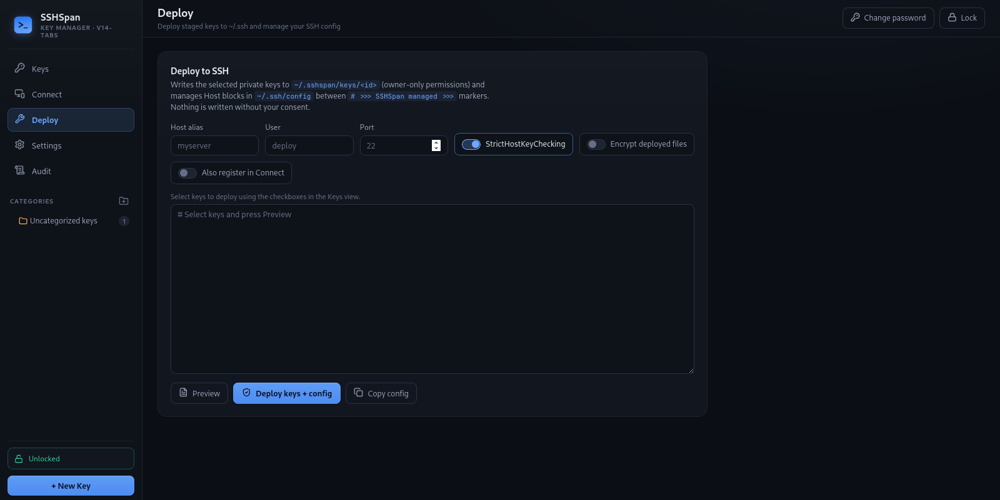
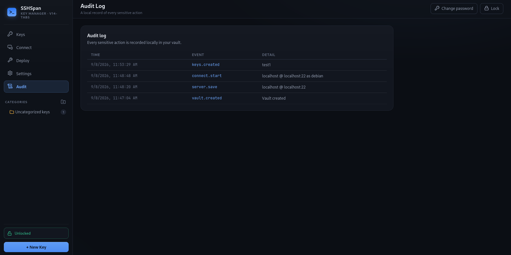
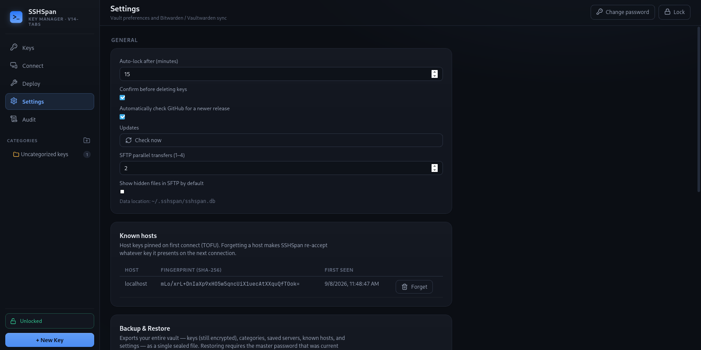

<p align="center">
  
</p>

# SSHSpan

Cross-platform SSH key manager, SSH client, and SFTP file transfer tool for the desktop -
built on **Rust + Tauri v2**.

SSHSpan gives you a single, encrypted home for every SSH key you own, a PuTTY-grade terminal
to use them, and a FileZilla-style file browser over the same live connection. Generate new
keys, import existing ones, organize keys and servers into separate category trees, deploy
keys into `~/.ssh/config`, connect to your servers, and move files - all from one
keyboard-friendly app. Private keys are encrypted at rest with AES-256-GCM behind a master
password; the master password itself lives only in memory and auto-locks after 15 minutes of
inactivity (locking also disconnects every live SSH session and stops every transfer).

All sensitive logic - crypto, vault, database, SSH, SFTP - runs in a compiled **Rust** core.
The UI is vanilla HTML/CSS/JS in your OS webview: no Electron, no bundled Chromium, no Node
runtime. The Windows installer is ~9 MB. Everything runs locally: no cloud, no telemetry, and
no network access unless you enable Bitwarden sync, which talks only to the server you
configure.

## What's new

- **v1.7.0** - PuTTY-style terminal utilities: right-click terminal/tab context menu, copy
  all, paste confirmation, duplicate/restart sessions, configurable scrollback, bell
  behavior, keyboard compatibility settings, SSH keepalive, and normal remote Tab
  completion through an explicit `TERM=xterm-256color` + UTF-8 PTY setup.
- **v1.6.0** - Separate key and host categories: the Keys view and the Hosts/Connect view
  each get their own category tree with independent recursive filters and uncategorized
  counts. Scope is enforced everywhere (assignments, parents, backup/restore) and syncs to
  Bitwarden under a separate `Hosts-` namespace. Plus a compact, keyboard-accessible
  category picker.
- **v1.5.0** - SFTP reaches FileZilla parity: background transfer queue, dual-pane browsing,
  chmod dialog, recursive search, per-server bookmarks, multi-select, sorting, remote disk
  usage, and SFTP keep-alive.
- Full history in the [changelog](CHANGELOG.md).

## Screenshots

A quick tour of the desktop UI:

<table>
  <tr>
    <td width="50%"></td>
    <td width="50%"></td>
  </tr>
  <tr>
    <td align="center"><strong>Keys and categories</strong><br>Manage encrypted keys in scoped category trees.</td>
    <td align="center"><strong>Embedded SSH client</strong><br>Connect with a saved server and use the integrated terminal.</td>
  </tr>
  <tr>
    <td width="50%"></td>
    <td width="50%"></td>
  </tr>
  <tr>
    <td align="center"><strong>SFTP file browser</strong><br>Browse remote files, use the dual-pane view, and queue transfers.</td>
    <td align="center"><strong>SSH deployment</strong><br>Preview and manage generated SSH config entries.</td>
  </tr>
  <tr>
    <td width="50%"></td>
    <td width="50%"></td>
  </tr>
  <tr>
    <td align="center"><strong>Audit log</strong><br>Review an append-only record of sensitive vault and connection actions.</td>
    <td align="center"><strong>Settings</strong><br>Configure transfer concurrency and other desktop preferences.</td>
  </tr>
</table>

## Features

### Keys
- **Generate** - RSA (3072-8192 bits), Ed25519, ECDSA (nistp256/384/521), via the audited
  `ssh-key` Rust crate.
- **Import** - browse or paste: OpenSSH private (incl. passphrase-protected), PKCS#8 PEM,
  PEM public, `authorized_keys` lines, and PuTTY `.ppk` **v3 and legacy v2**
  (passphrase-protected too).
- **Export** - OpenSSH new-format private, PuTTY `.ppk` v3, PKCS#8 PEM (plain or encrypted),
  SPKI PEM public, `authorized_keys` lines. Legacy v2 `.ppk` imports are written back as v3.
- **Encrypted vault** - AES-256-GCM envelopes; the master password is never stored.

### Categories
- Two independent trees: **key categories** for keys, **host categories** for saved servers -
  any depth, many-to-many, drag-and-drop in the sidebar, breadcrumbs, grouped lists, and a
  shared multi-select picker with search and full keyboard navigation.
- The Keys view and Hosts view each filter through their own tree, with explicit
  "uncategorized" entries and live counts.
- Both trees **sync with Bitwarden**: key categories are encoded into cipher `notes`, host
  categories travel under a separate `Hosts-` namespace, so two SSHSpan installs (or a
  reinstall) converge on the same structure.

### Connect - embedded SSH client
- **Saved servers** with per-server username + SSH-key binding; optional password storage
  (sealed with your vault master, unsealed only in-process at connect time).
- **Interactive terminal** (xterm.js + the `russh` Rust SSH library): full ANSI colors,
  configurable scrollback, resizable grid, explicit UTF-8 PTY, and `TERM=xterm-256color`.
- **PuTTY behaviors**: select text to copy instantly, right-click terminal/tab menu,
  Copy All, paste with optional multi-line confirmation, Ctrl+Shift+C/V, duplicate and
  restart sessions, clear/reset terminal, visual or sound bell, keyboard compatibility
  settings, and optional SSH keepalive.
- **Host-key pinning (TOFU)** - first connection stores the server's fingerprint; any change
  is refused with a clear warning.
- **Right-click any key -> "Use this key to connect..."** - pick a saved server (its username
  + your clicked key) or create a new server pre-filled with that key.
- **Vault-gated**: locking the vault immediately disconnects every live session.
- Test button per server (open -> authenticate -> close, with latency).

### SFTP - embedded file transfer
Runs over the same live SSH connection as the terminal - no second login, no extra port:
- **Background transfer queue** - uploads and downloads run on dedicated SFTP channels, so
  browsing stays responsive while transfers stream progress, speed, cancel/retry, and
  Queued/Failed/Done tabs. Directories expand recursively in both directions; two transfers
  run in parallel by default (1-4 configurable).
- **Dual-pane mode** - optional local pane with a draggable splitter; drag or double-click a
  local file to upload, double-click folders to navigate, drop files from your OS onto the
  remote pane.
- **File permissions** - chmod dialog with an owner/group/other read/write/execute grid,
  live octal sync, recursion, and files/directories/all targeting.
- **Recursive remote search** - case-insensitive search across the current directory tree
  with live-streaming results; click a result to jump to its folder.
- **Per-server bookmarks** - save remote (and local) directories via the toolbar star and
  return in one click.
- **File-manager ergonomics** - multi-select (Ctrl-click, Shift-click, Ctrl+A), sortable
  Name/Size/Modified columns, hidden-dotfile toggle, context menu (download, delete, chmod,
  new file, copy path, copy `sftp://` URL), double-click to open or enqueue.
- **Remote disk usage** - free/total space via `statvfs@openssh.com` beside the path bar,
  hidden automatically when the server lacks support.
- **Keep-alive** - a 30-second round-trip keeps idle sessions alive through NATs and
  firewalls; stopped on close, disconnect, or vault lock.
- **Per-tab activity log** - timestamped connect/transfer/chmod/search/delete events.

### Sync & deploy
- **Bitwarden / Vaultwarden sync (optional)** - mirror keys to SSH-key items in your own
  vault, two-way, deletions never propagated; works with getbitwarden.com and self-hosted
  Vaultwarden (SSRF-hardened server URL validation).
- **Deploy to SSH** - writes selected keys to `~/.sshspan/keys/<id>` (owner-only
  permissions) and manages reversible `Host` blocks between marker comments in
  `~/.ssh/config`.
- **Backup and restore** - full vault backups (keys, servers, both category trees) to a
  single encrypted file, restorable only with the master password current at backup time.

### Trust & ops
- **Audit log** - append-only local record of every sensitive action (key lifecycle, vault
  lock/unlock, connects, server changes, backups).
- **DevTools available in release builds** (F12) - the UI layer holds no secrets by design.
- **Small & fast** - ~9 MB Windows installer, ~16 MB Linux packages; no Chromium, no Node
  runtime.

## Installation

### From a release (recommended)
Grab the latest installer from [Releases](https://github.com/AGSQ11/SSHSpan/releases) -
current release is **v1.7.0**:

| Platform | Files |
| --- | --- |
| Windows | `SSHSpan_1.7.0_x64-setup.exe` (NSIS, per-user) · `SSHSpan_1.7.0_x64_en-US.msi` (system-wide) |
| Linux | `SSHSpan_1.7.0_amd64.deb` · `SSHSpan-1.7.0-1.x86_64.rpm` |

### Build from source
Prerequisites: [Rust](https://rustup.rs) (stable), Node.js >= 18 (for the Tauri CLI), and on
Linux the Tauri system dependencies (`libwebkit2gtk-4.1-dev`, `libgtk-3-dev`,
`libayatana-appindicator3-dev`, ...).

```bash
npm install
npm run tauri dev      # run in development
npm run tauri build    # produce installers in src-tauri/target/release/bundle/
```

Windows builds: `npm run dist:win` · Linux builds: `npm run dist:linux`.
Rust tests: `cargo test --manifest-path src-tauri/Cargo.toml`.

## Architecture (in one paragraph)

A **Tauri v2** app: a Rust binary (`src-tauri/`) owns the SQLite vault (sqlx), all
cryptography (`ssh-key`, `aes-gcm`, `bcrypt-pbkdf`, `chacha20poly1305`, `ring`), the
Bitwarden client, the SSH deploy service, and the russh session + SFTP engines; the webview
UI (`src/renderer/`) is plain HTML/CSS/JS that talks to Rust through typed IPC commands.
Private key material is decrypted only inside Rust processes and never crosses the IPC
boundary. The full Node.js -> Rust migration story, per-version changelog, and engineering
notes live in [`docs/REWRITE-ROADMAP.md`](docs/REWRITE-ROADMAP.md); the process/module layout
is in [`docs/ARCHITECTURE.md`](docs/ARCHITECTURE.md).

## Security

Private keys are encrypted at rest (AES-256-GCM, bcrypt-pbkdf2 KDF) and only ever decrypted
in-process. The master password is never persisted - only a verification hash. Host keys are
pinned trust-on-first-use. See [docs/SECURITY.md](docs/SECURITY.md) and
[docs/PRIVACY.md](docs/PRIVACY.md).

## License

MIT - see [LICENSE](LICENSE).
